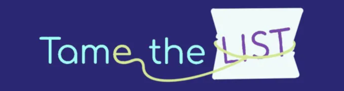

  <!-- Add badges using the following format: -->
  <!-- (urlToGithubHere) -->

<!-- PROJECT LOGO -->

  

<h3 align="center">Tame the List</h3>

  

    <a href="https://github.com/jazztazz1991/TameTheList">Explore the docs » </a>
    <a href="https://github.com/jazztazz1991/TameTheList">View Demo (In Development) » </a>
    <a href="https://github.com/jazztazz1991/TameTheList/issues">Report Bug » </a>
    <a href="https://github.com/jazztazz1991/TameTheList/issues">Request Feature » </a>
  

<!-- TABLE OF CONTENTS -->

  
Table of Contents

  <ol>
    <li>
      <a href="#about-the-project">About The Project</a>
      <ul>
        <li><a href="#built-with">Built With</a></li>
      </ul>
    </li>
    <li>
      <a href="#getting-started">Getting Started</a>
      <ul>
        <li><a href="#installation">Installation</a></li>
      </ul>
    </li>
    <li><a href="#usage">Usage</a></li>
    <li><a href="#roadmap">Roadmap</a></li>
    <li><a href="#contributing">Contributing</a></li>
    <li><a href="#license">License</a></li>
    <li><a href="#contact">Contact</a></li>
    <li><a href="#acknowledgments">Acknowledgments</a></li>
  </ol>

<!-- ABOUT THE PROJECT -->

## About The Project

<!-- Add screenshots using the following format: -->
<!--  -->
<!-- TODO: ADD SCREENSHOTS -->

This project was built with basic Javascript, Html, and CSS.
It uses Materialize for a CSS framework.
It also makes use of packages dayjs and jquery and gsap.
Tame the List is your one-stop shop for conquering your tasks, no matter your productivity style.

## Tame the List is Perfect For:

- \*Visual Thinkers:\*\* Kanban boards let you see your progress at a glance.
- \*List Lovers:\*\* Classic checklist view keeps you on track.
- \*Gamers with a Goal:\*\* Race against the clock and earn that sweet dopamine rush from completing even the most tedious tasks.

### Stop Taming the List, Start Taming Your Day. Sign Up Today!

### Built With

<!-- TODO: TECH -->
<!--  Concurrently, Bcrypt, Body-Parser, Cors, Dotenv, Express, form-data, joi, mongodb, mongoose, node, nodemon, axios, jw-cookie, mdi-react, Tailwind, React, Eslint, Vite, -->

<!-- 

 -->

<!-- GETTING STARTED -->

## Getting Started

Once completely built, this application will function as a deployed app on Render

### Installation

1. Clone the repo
   git clone https://github.com/jazztazz1991/TameTheList.git

<!-- USAGE EXAMPLES -->

## Usage

Once the app is functional, screenshots will be added in this section.

<!-- ROADMAP -->

## Roadmap

- [ ] Front End

  - [x] Test 1
  - [x] Test 2
  - [x] Test 3
  - [x] Test 4
  - [ ] Test 5

- [ ] Back End
  - [x] Test 1
  - [x] Test 2
  - [x] Test 3
  - [x] Test 4
  - [ ] Test 5

See the [open issues](https://github.com/jazztazz1991/TameTheList/issues) for a full list of proposed features (and known issues).

#### Future Development

- [x] Test 1
- [x] Test 2
- [x] Test 3
- [x] Test 4
- [ ] Test 5

<!-- CONTRIBUTING -->

## Contributing

Contributions are what make the open source community such an amazing place to learn, inspire, and create. Any contributions you make are **greatly appreciated**.

If you have a suggestion that would make this better, please fork the repo and create a pull request. You can also simply open an issue with the tag "enhancement".
Don't forget to give the project a star! Thanks again!

1. Fork the Project
2. Create your Feature Branch (git checkout -b feature/AmazingFeature)
3. Commit your Changes (git commit -m 'Add some AmazingFeature')
4. Push to the Branch (git push origin feature/AmazingFeature)
5. Open a Pull Request

<!-- LICENSE -->

## License

This project is licensed under the MIT license.

See LICENSE.txt for more information.

<!-- CONTACT -->

## Contact

Mary Elenius - mary.panda.jackson@gmail.com
Code Chase - cchase1991@gmail.com

<!-- TODO: Add Christian's email -->

Christian Abbate - totallyarealemail.com
Royce Atkins - royceatkins93@gmail.com

<!-- TODO: Add Bree's email -->

Breanna Nouskhajian - totallyrealemail.com
Anthony Muscarella - muscarellaanthony1@gmail.com

Project Link: 
Deployment Link: 

<!-- ACKNOWLEDGMENTS -->

## Acknowledgments

### Mary Elenius

I would like to give a big shoutout to my partner in crime and daughter, Yennefer! Every day she proves she is small yet mighty!

### Cody Chase

TODO: Write something tear-entincing here

### Christian Abbate

TODO: Write something tear-entincing here

### Royce Atkins

TODO: Write something tear-entincing here

### Breanna

TODO: Write something tear-entincing here

### Anthony Muscarella

TODO: Write something tear-entincing here
